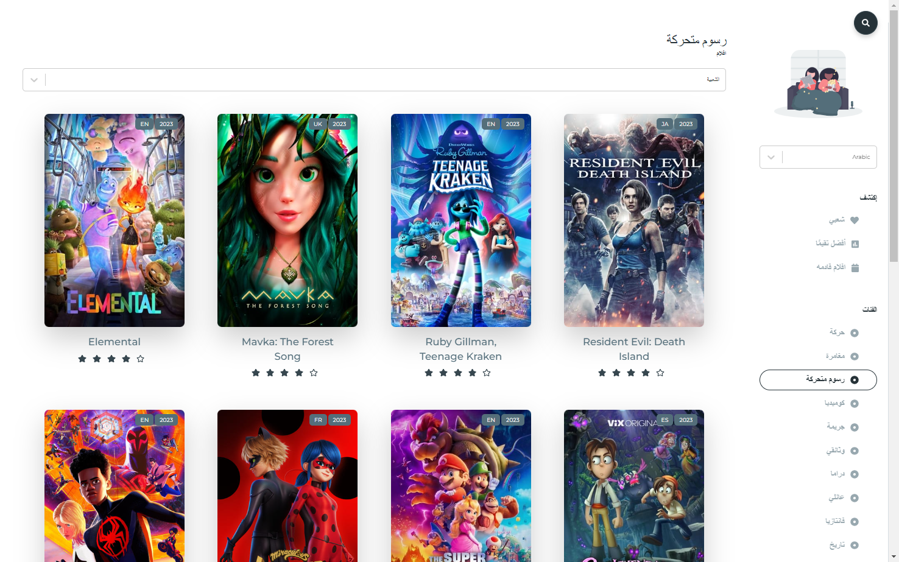
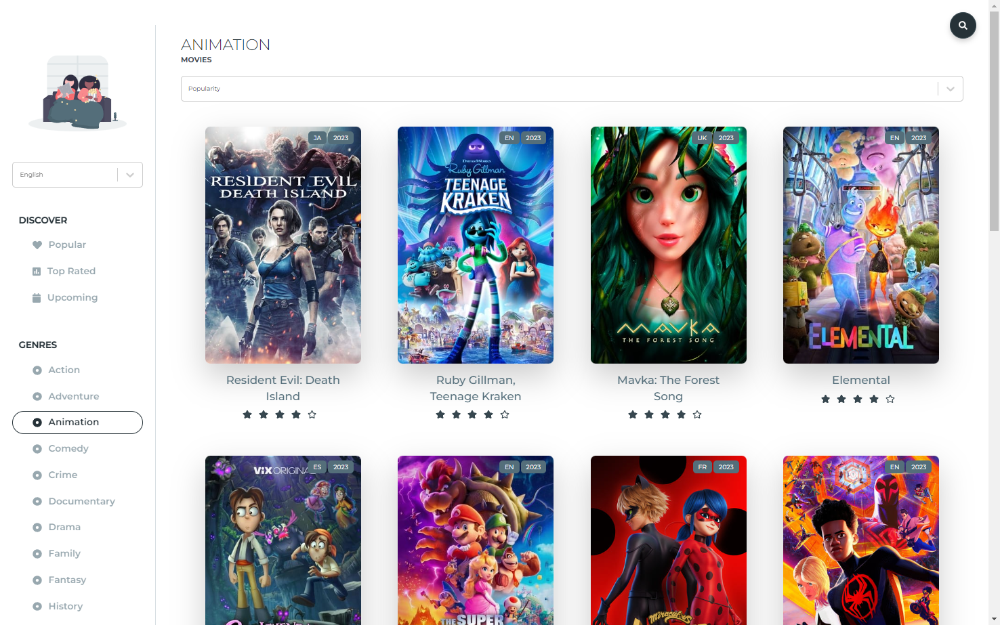
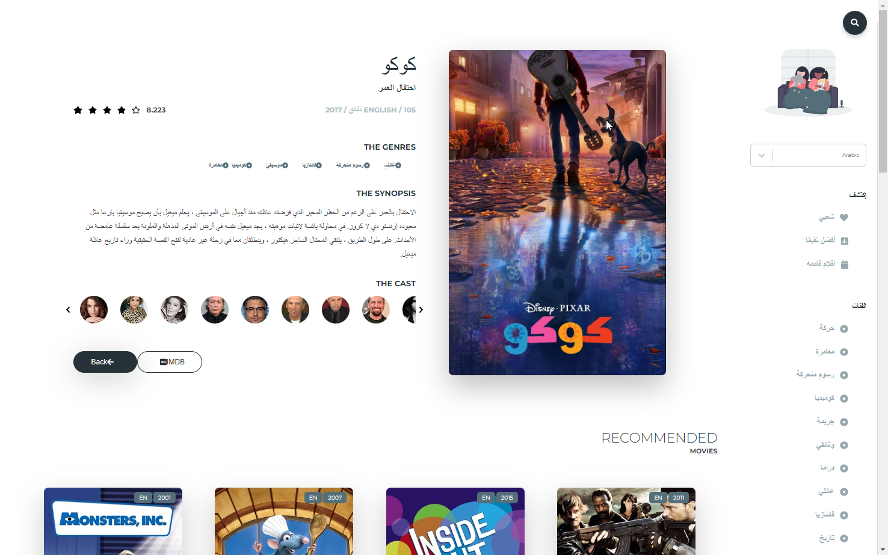
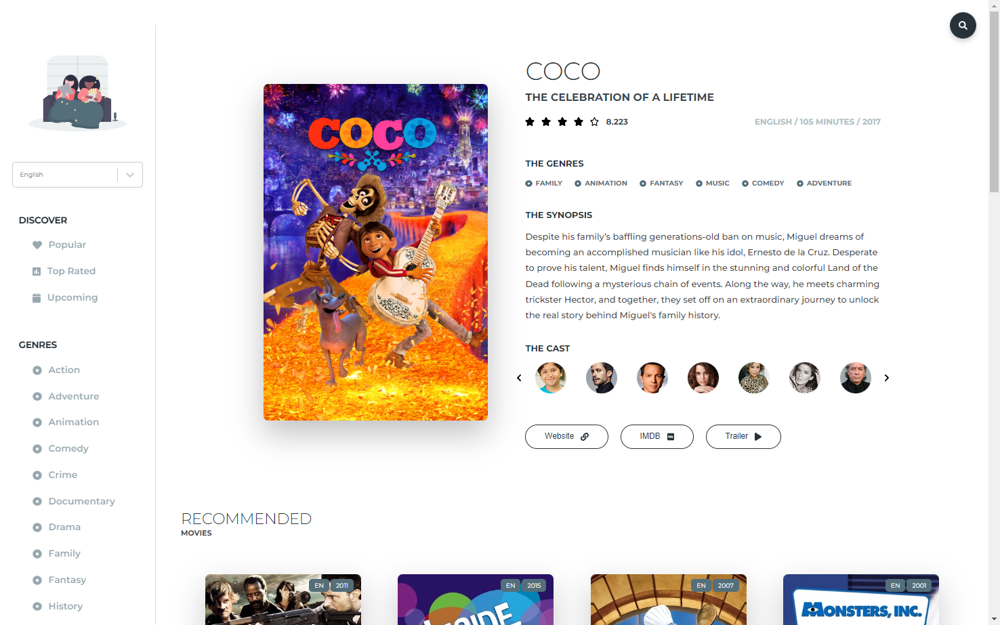

# Movie Library w/ ReactJS









A Modern Movie Library made with ReactJS using The Movie Database API

## Features

* Fully responsive
* Multi-language support
* RTL & LTR support
* TMDB API support

## Language

Languages can be easily added to website by modifying `src/utils/languages.js`

### Prerequisites

You need to create an API KEY in [The Movie Database API](https://www.themoviedb.org/documentation/api)
Create an `.env` file on the root of the project and put your API key

```
REACT_APP_API=yourapikeyhere
```

### Installing

Clone the Repository and run

```
npm install
npm run dev
```

## Deployment

To deploy simply run

```
npm run build
```

## Built With

- [React JS](https://reactjs.org/)
- [React Router](https://github.com/ReactTraining/react-router)
- [Redux](https://redux.js.org/)
- [Redux Thunk](https://github.com/reduxjs/redux-thunk)
- [Styled Components](https://www.styled-components.com)
